# P3: Movimiento - Físicas
## Hoja 1 - Experimentando con la física desde el editor
1. **El plano no es un objeto físico. El cubo es un objeto físico y la esfera no. En este caso, el plano y la esfera sólo tendrán collider, mientras que el cubo debe tener Rigidbody.**
  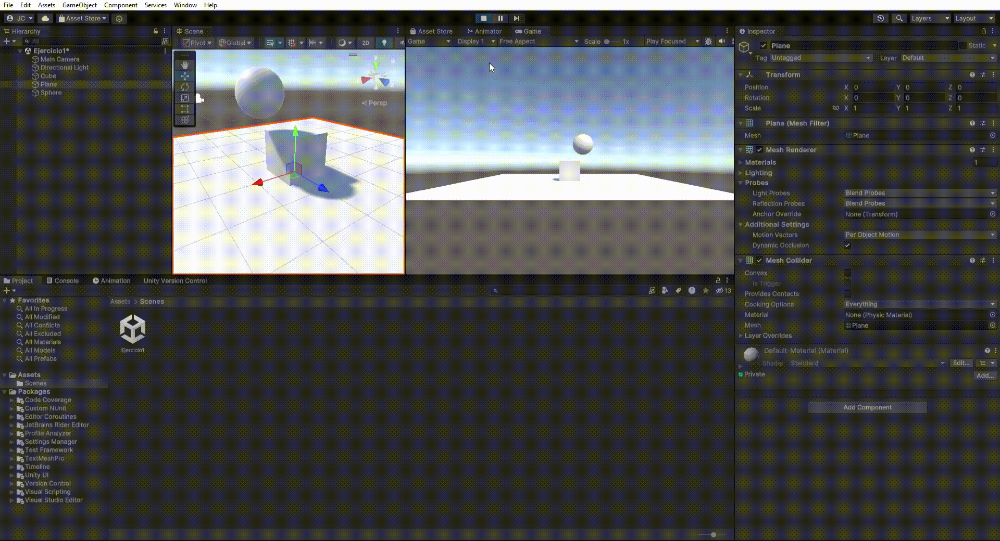
Observamos que el cubo se mantiene quieto ya que aunque se le aplica la física, y por tanto la gravedad, está apoyado sobre el collider del plano. La esfera y el plano están quietos ya que no se les aplica la física.
2. **El plano no es un objeto físico. El cubo es un objeto físico y la esfera también. En este caso, el plano sólo tendrán collider, mientras que el cubo y la esfera deben tener Rigidbody.**
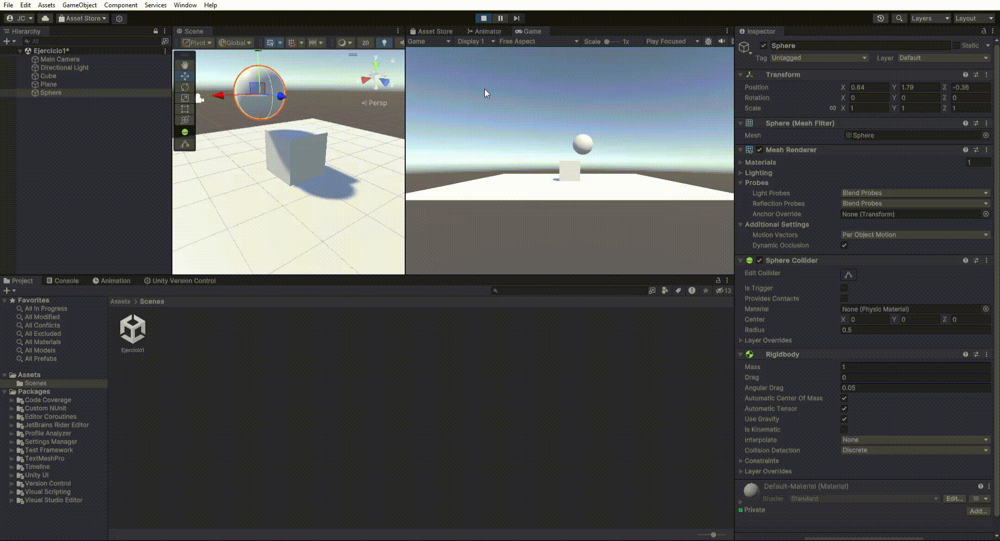
Ahora vemos que la gravedad afecta a la esfera, que cae chocando con el cubo y el plano ya que tienen collider. El plano no se cae ya que no se le aplica la física.
3.**El plano no es un objeto físico. El cubo es un objeto físico y la esfera es cinemática. En este caso, el plano sólo tendrán collider, mientras que el cubo y la esfera deben tener Rigidbody esta última cinemático.**

Observamos que pese a que la esfera tiene rigidbody al ser cinemática no se le aplica la física y por tanto se queda quieta sin sufrir gravedad.
4. **El plano es un objeto físico. El cubo es un objeto físico y la esfera es física. En este caso, todos los objetos deben tener Rigidbody.**
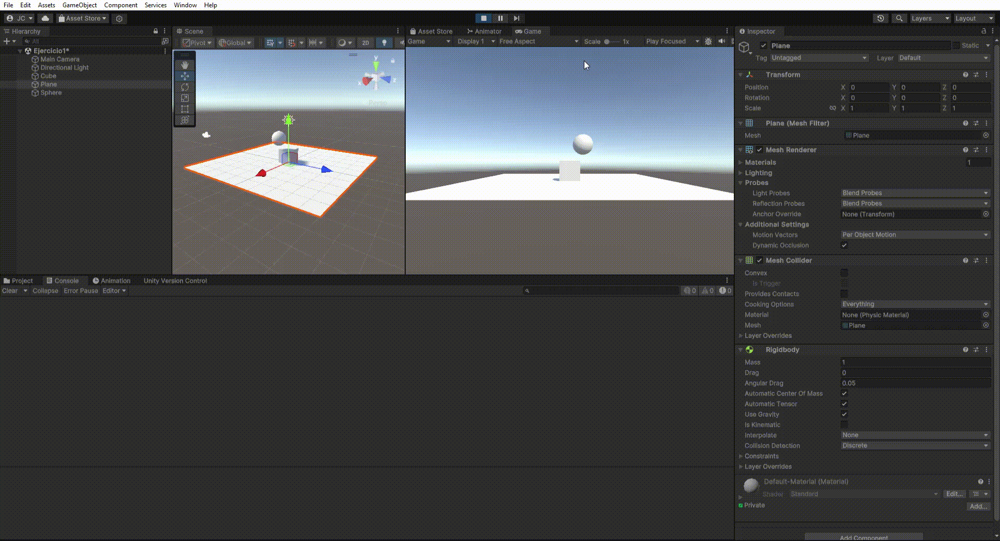
Vemos que como todos los objetos son físicos sufren la gravedad, por lo que todos caen a la vez hacia el vacío.
5. **El plano es un objeto físico. El cubo es un objeto físico y la esfera es física con 10 veces más masa que el cubo. En este caso, todos los objetos deben tener Rigidbody.**
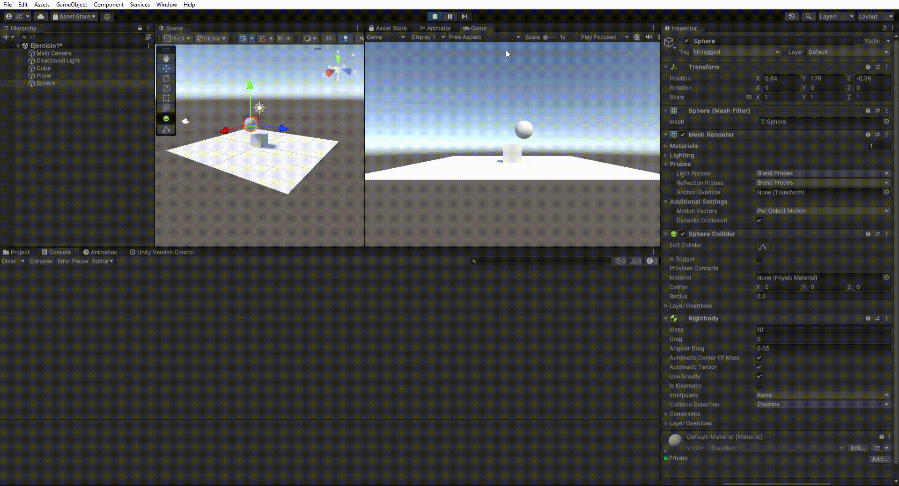
Apreciamos que la esfera cae a la misma velocidad que el resto de objeto a pesar de tener más masa. Esto es debido a que los objetos están en el vacío/no sufren fricción.
6. **El plano es un objeto físico. El cubo es un objeto físico y la esfera es física con 100 veces más masa que el cubo. En este caso, todos los objetos deben tener Rigidbody.**
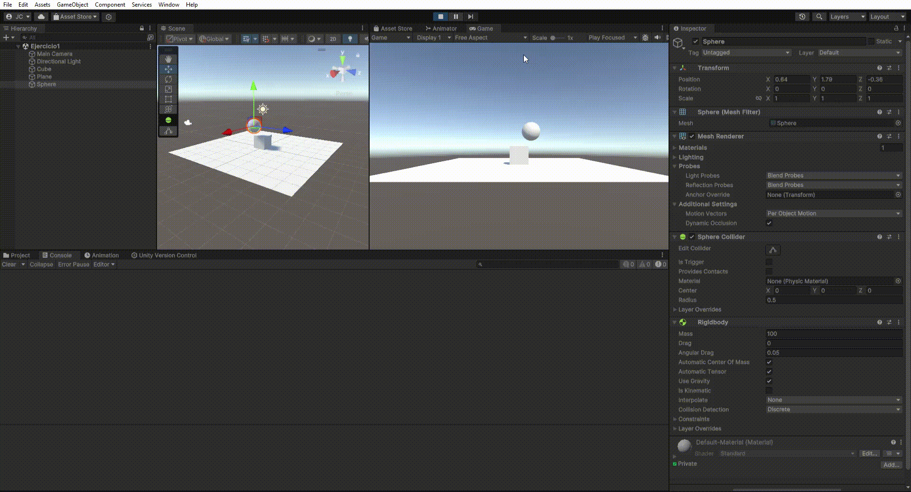
Aumentar la masa de la esfera no cambia nada ya que sigue sin haber fricción.
7. **El plano es un objeto físico. El cubo es un objeto físico y la esfera es física con fricción. En este caso, todos los objetos deben tener Rigidbody.**
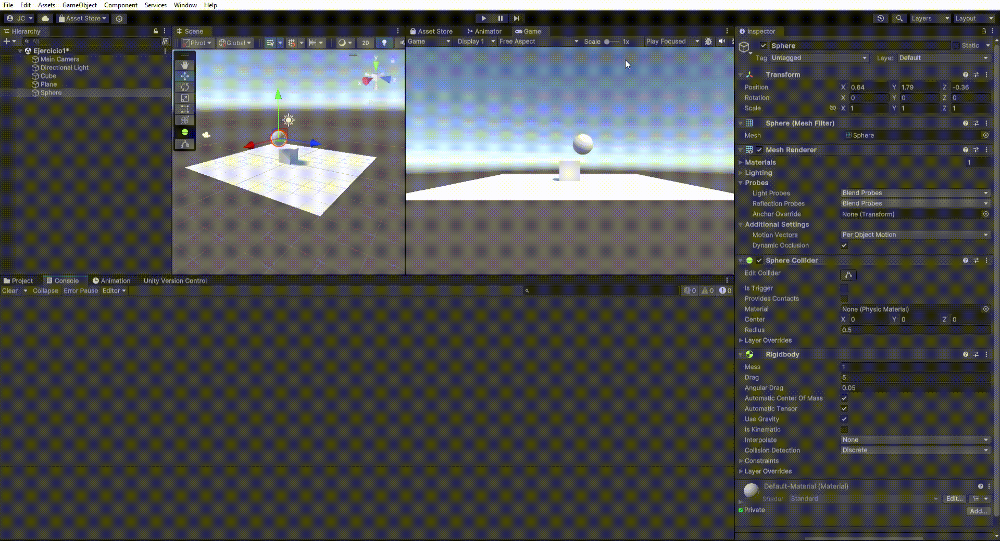
Ahora, debido a que la esfera tiene fricción (que establecemos con el ajuste ```drag```), ejerce resistencia con el "aire" y cae a menor velocidad que el resto de objetos.
8. **El plano es un objeto físico. El cubo es un objeto físico y la esfera no es física y es Trigger. En este caso, todos los objetos deben tener Rigidbody.**
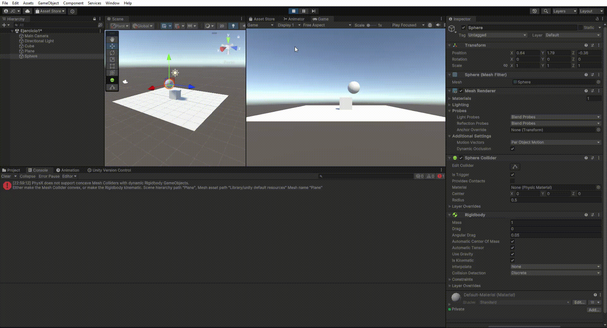
Vemos que, al no ser física, la esfera no sufre la gravedad, por lo que se queda quieta. Que sea trigger no afecta a nada.
9. **El plano es un objeto físico. El cubo es un objeto físico y la esfera es física y es Trigger. En este caso, todos los objetos deben tener Rigidbody.**

Vemos que, al ser física, la esfera sí sufre la gravedad, al igual que el resto de objetos de la escena. Por tanto, no se puede percibir la diferencia de que sea trigger respecto a cuando no lo es (Caso 4).

## Hoja 2 - Movimiento - Físicas
1.  
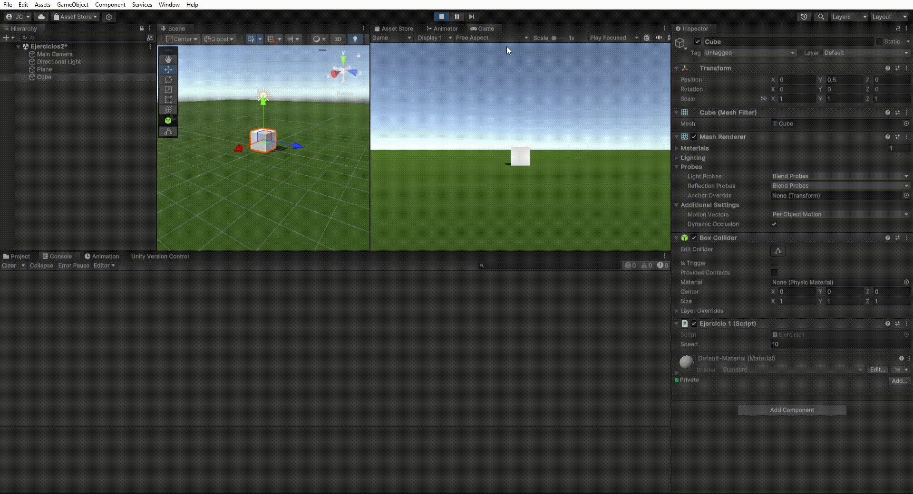
2.  
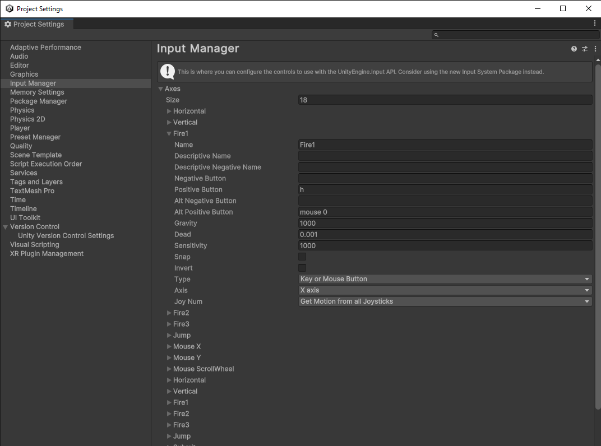
En la sección de project settings se abre el InputManager y se cambia la tecla asignada a h.  
3.  

Nota: se ha usado el Time.deltaTime para el desplazamiento.
 - a  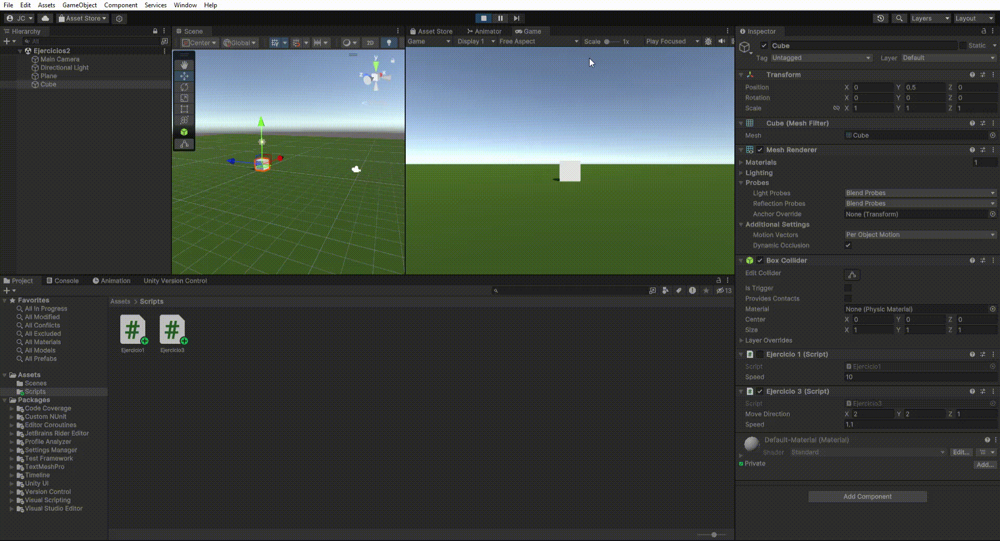
  Observamos que el cubo se desplaza al doble de velocidad.
 - b
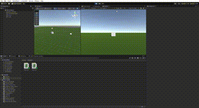
Al igual que en el caso a, observamos que el cubo se desplaza al doble de velocidad.
 - c  
Observamos que la velocidad ahora es menor
 - d  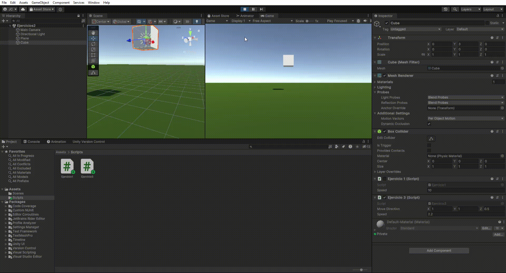
En este caso no se observa gran diferencia.
 - e  
Como el sistema de coordenadas local estaba alineado con el global, no se ve diferencia.

4.  
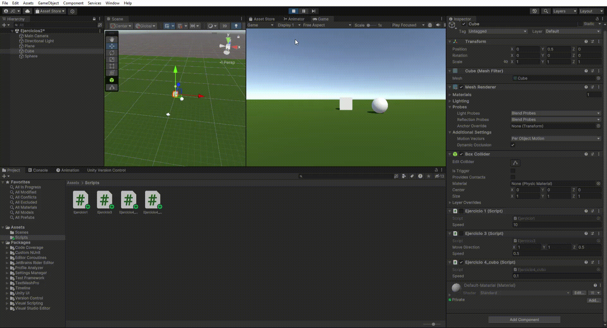
Nota: Se ha optado por usar un script para el cubo y otro para la esfera. Se detecta cada tecla y en cada caso se realiza el transalte con el vector adecuado (Vector3.left, Vector3.forward...). Las velocidades se han fijado en 0.1 para el cubo y 0.2 para la esfera.

5. 
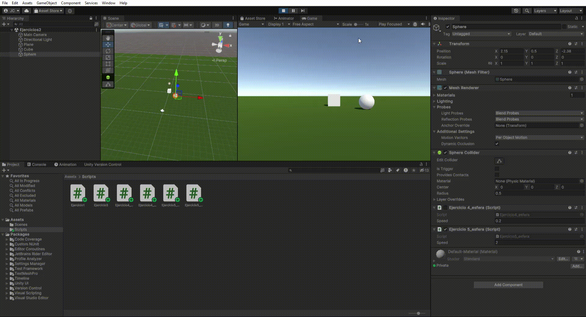
En el translate se multiplica el vector además de por la velocidad, por el Time.deltaTime. En este caso las velocidades se aumentan a 2 para la esfera y 1 para el cubo.

6. 

Se obtiene el vector de la dirección de movimiento restando posición destino (esfera) menos origen (cubo). El vector resultante se normaliza y multiplica por velocidad y deltaTime.

7. 
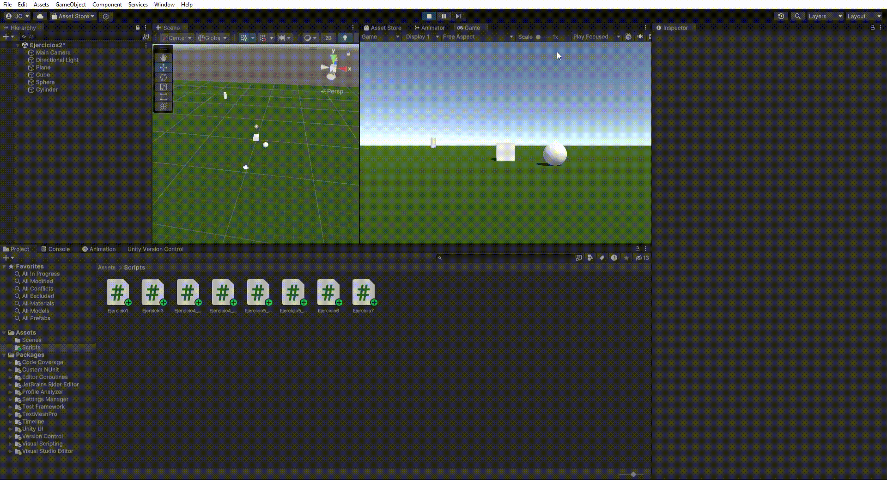
Se emplea el método lookAt para que el cubo mire al tranform de la esfera. Es necesario que el translate empleado en el ejercicio 6 sea relativo al espacio del mundo, ya que ahora el tranform local del cubo no está alineado con el del mundo.

8. 
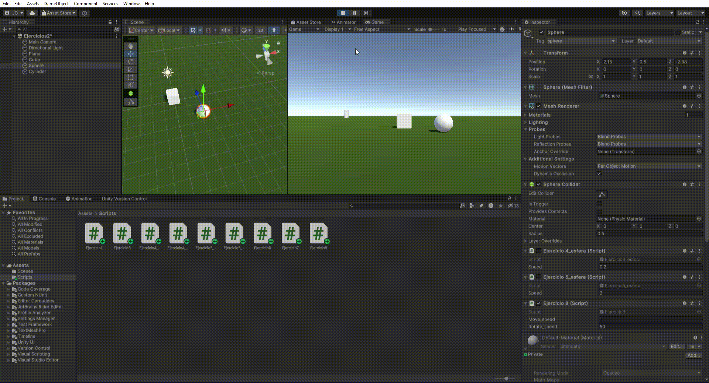
Se usa el vector transform.forward con el translate referente al sistema del mundo (en vez del local) para el avence delante-atrás con las teclas w-s. El giro se realiza con la función rotate, sobre el eje Vector3.up. Se fija una velocidad distinta para el movimiento hacia delante y otra para el giro.

9. 
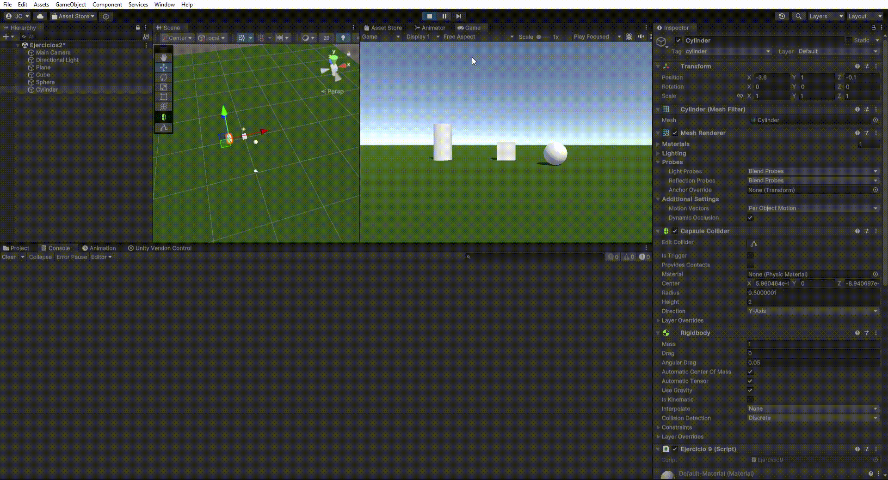
El cilindro no puede ser físico y trigger, ya que atravesaría el plano. Por tanto, el cubo y la esfera son los trigger. Se usa el evento OnCollisionEnter para detectar la colisión.

